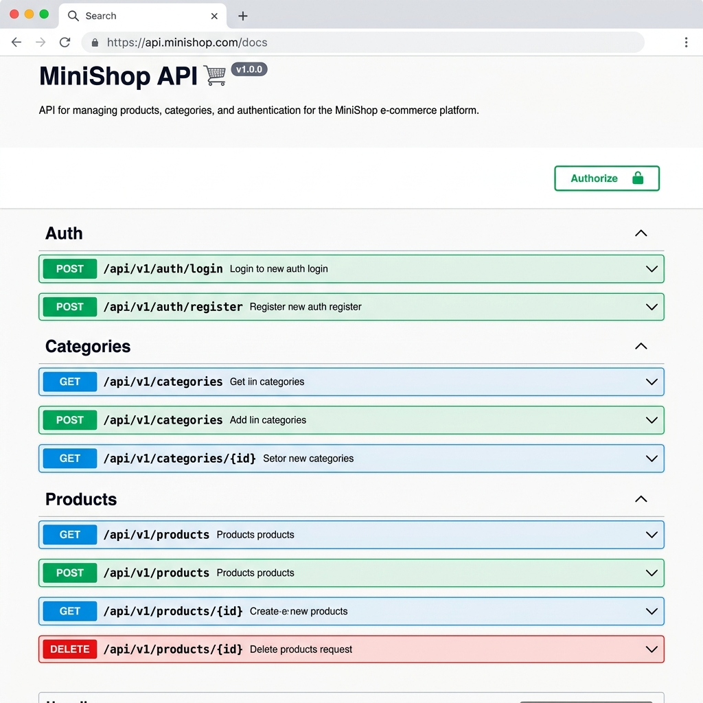

## Student
- Name: Дідик Богдан
- Group: 232/2
 
## Практичне заняття №6 — Interceptors + Exception Filters + Swagger
 
### Структура репозиторію
```
.
├── src/
│   ├── auth/ ...
│   ├── users/ ...
│   ├── categories/ ...
│   ├── products/ ...
│   ├── common/
│   │   ├── enums/
│   │   │   └── role.enum.ts
│   │   ├── guards/
│   │   │   ├── jwt-auth.guard.ts
│   │   │   └── roles.guard.ts
│   │   ├── decorators/
│   │   │   ├── current-user.decorator.ts
│   │   │   └── roles.decorator.ts
│   │   ├── interceptors/
│   │   │   ├── logging.interceptor.ts
│   │   │   └── transform.interceptor.ts
│   │   ├── filters/
│   │   │   └── http-exception.filter.ts
│   │   └── pipes/
│   │   	└── trim.pipe.ts
│   ├── migrations/
│   ├── main.ts
│   └── app.module.ts
├── swagger-screenshot.png
├── Dockerfile
├── docker-compose.yml
└── README.md
```
 
### Запуск проекту
```bash
cp .env.example .env
docker compose up --build
```
 
### Swagger UI
http://localhost:3000/api/docs
 

 
### Формат успішної відповіді
```json
{
  "data": {
    "id": 1,
    "name": "iPhone 16",
    "price": 999.99
  },
  "statusCode": 200,
  "timestamp": "2026-05-01T09:49:12.929Z"
}
```
 
### Формат помилки
```json
{
  "error": {
    "code": 400,
    "message": "Validation failed",
    "details": [
      "name must be longer than or equal to 2 characters"
    ],
    "traceId": "0b26ba0d-e16e-438a-a1b8-0dd234443c99"
  },
  "timestamp": "2026-05-01T09:49:32.104Z"
}
```
 
### Приклад логів (LoggingInterceptor)
```text
[Nest] 29  - 05/01/2026, 9:49:09 AM     LOG [HTTP] GET /api/products — 200 — 18ms
[Nest] 29  - 05/01/2026, 9:49:12 AM     LOG [HTTP] GET /api/products — 200 — 2ms
```
 
### Тест помилки з traceId
```text
curl.exe -s http://localhost:3000/api/products/999
{"error":{"code":404,"message":"Продукт з ID #999 не знайдений","traceId":"529f8192-0923-4ec3-95cd-6dd7f5f7f101"},"timestamp":"2026-05-01T09:49:24.953Z"}
```
